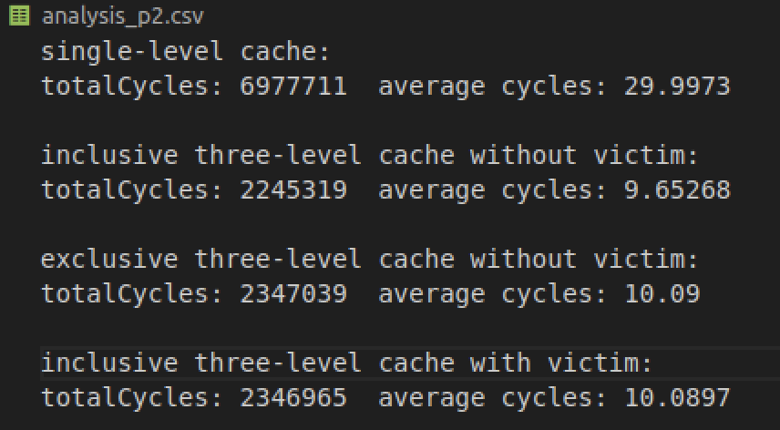
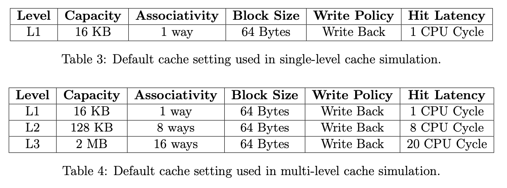
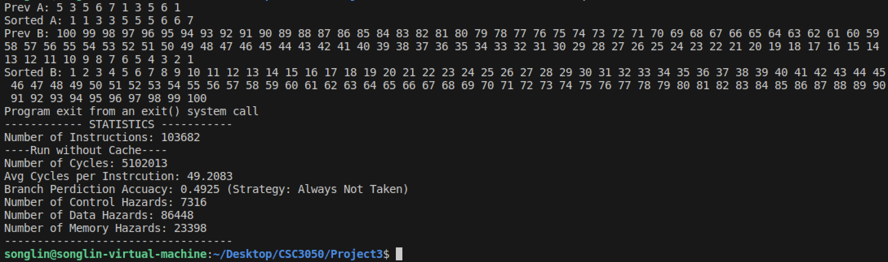
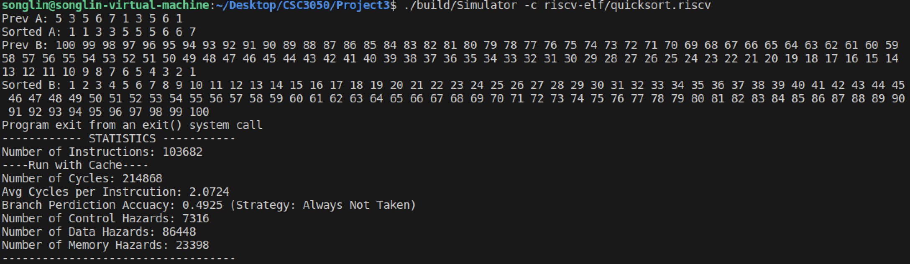
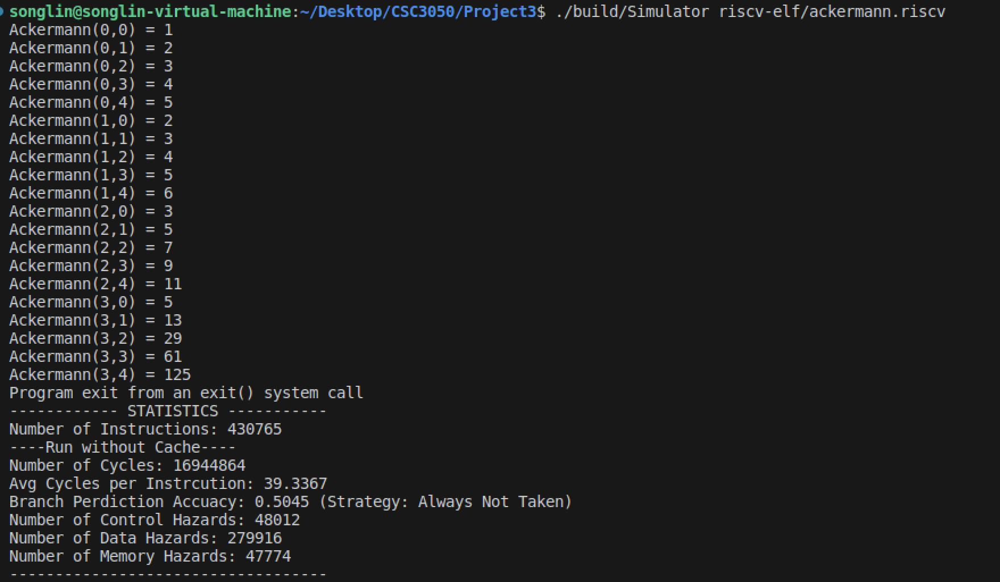
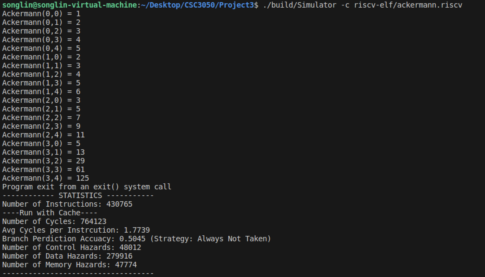

## Usage

Before testing, please put the folders `./cache-trance` and `./riscv-elf` inside the working directory, at the same level as `./src` and `./include`.

### Run Single-Level Cache Simulation

```bash
cd /the_working_space
chmod +x build1.sh
./build1.sh
# Now the single-level cache simulator will be run,
# and the .csv file ./src/analysis_p1.csv will be generated
```

### Run Multi-Level Cache Simulation

```base
chmod +x build2.sh
./build2.sh
# Now the multi-level cache simulator will be run,
# and the .csv file ./src/analysis_p2.csv will be generated
```

### Run Integration with CPU Simulator

```base
chmod +x build3.sh
./build3.sh
./build/Simulator riscv-elf/quicksort.riscv  # run without cache
./build/Simulator -c riscv-elf/quicksort.riscv  # run with cache
# the statistics will be printed in the terminal
```

## Single-Level Cache Simulation

In the first part of this project, I implemented a single-level cache. The cache takes parameters including underlying memory, hit latency, cache size, block size, associativity, write back, write allocate, .etc.

### Write Back and Write Allocate

There are four cases for write back and write allocate policies:

1. **Write-Back = True, Write-Allocate = True**: When a write miss occurs, the cache block containing the target address is loaded into the cache, and then the write operation is performed on the cached block. The modified block is marked as dirty but is not immediately written back to main memory. The dirty data is only written back to the main memory when the cache block is evicted.
2. **Write-Back = True, Write-Allocate = False**: When a write operation occurs, the data is written directly to main memory. However, if the data is already in the cache, it is updated in the cache and marked as dirty. It will only be written back to the main memory upon eviction.
3. **Write-Back = False, Write-Allocate = True**: When a write miss occurs, the cache block is loaded into the cache, and the write operation is executed on the cache. However, all writes to the cache will also be written to main memory.
4. **Write-Back = False, Write-Allocate = False**: When a write operation occurs, the data is written directly to main memory. No write back is used.

## Performance Analysis

The following image shows how different block sizes affect cache performance. We can observe that when holding all other conditions constant, the larger the block size, the better the cache performance. This could be explained by the fact that larger block sizes can bring a larger block of data during a cache miss, which increases the possibility of the next hit.

<table>
  <tr>
    <td style="width: 50%; text-align: center;">
      <br>
      <em>Figure 1: Block Size vs. CPI</em>
    </td>
    <td style="width: 50%; text-align: center;">
      <br>
      <em>Figure 2: Block Size vs. Miss Rate</em>
    </td>
  </tr>
</table>

The following image shows how different cache sizes affect cache performance. We can observe that when holding all other conditions constant, increasing the cache size significantly improves performance. However, under the same cache size, the performance of different block sizes does not vary that much. A larger cache size means more faster memory, which will definitely increase performance.

<table>
  <tr>
    <td style="width: 50%; text-align: center;">
      <br>
      <em>Figure 4: Cache Size vs. CPI</em>
    </td>
    <td style="width: 50%; text-align: center;">
      <br>
      <em>Figure 5: Cache Size vs. Miss Rate</em>
    </td>
  </tr>
</table>

The following image demonstrates the influence of associativity on cache performance. When the cache size is 4KB, increasing the associativity can cause better performance at first but worse performance later. However, when the cache size is 16KB, the relationship is positive, while when the cache size is 64KB, the relationship is negative. This shows that increasing associativity does not necessarily mean increasing or decreasing performance.

<table>
  <tr>
    <td style="width: 33%; text-align: center;">
      <br>
      <em>Figure 7: Cache Size 4KB</em>
    </td>
    <td style="width: 33%; text-align: center;">
      <br>
      <em>Figure 8: Cache Size 16KB</em>
    </td>
    <td style="width: 33%; text-align: center;">
      <br>
      <em>Figure 9: Cache Size 64KB</em>
    </td>
  </tr>
</table>

## Multi-Level Cache Simulation

### Inclusive Cache

In inclusive cache, if a block of data is present at a certain level, all lower levels will contains that block of data.

### Exclusive Cache

For exclusive cache, a block of data only exists in a certain level of cache.

### Victim Cache

The victim cache is only connected to the L1 cache, and stores the recently evicted cache from the L1 cache. The vitim cache is only 8 blocks and it is fully associative.

### Performance Analysis

The following figure shows the performance of single-level cache, inclusive three-level cache without victim cache, exclusive three-level cache without victim cache, and inclusive three-level cache with victim cache.

<table>
  <tr>
    <td style="width: 50%; text-align: center;">
      <br>
      <em>Figure 1: The Cache performance of different settings</em>
    </td>
    <td style="width: 50%; text-align: center;">
      <br>
      <em>Figure 2: Default cache setting used in multi-level cache simulation</em>
    </td>
  </tr>
</table>

### Single and Multi-level Cache

The performance of multi-level cache is 3 times faster than single-level cache. This is because the addition of L2 and L3 cache shortens the distance between CPU and memory.

### Inclusive and Exclusive Cache

The performance of inclusive and exclusive cache is similar, while exclusive cache might be a little bit slower. Although exclusive cache saves more space for lower-level data, it can be a little bit slower. This can be explained by the fact that the L1 cache is small. **For inclusive cache, the block is only evicted from L1 cache when the L1 cache is full, and the dirty bit is 1. However, for exclusive cache, the block is evicted only if the L1 cache is full, no matter whether it is dirty**. As a result, it causes more cycles during testing because exclusive cache takes more time to write to L2 caches. The other latencies for inclusive and exclusive caches are the same. They both check all absent caches during a cache miss. **During cycles calculation, if a cache miss occurs, inclusive cache might both look up and write to the cache, exclusive cache might only look up the cache without writing to it, however, I only calculated once for the latency to mimic the real-world behavior.**

### With and Without Victim Cache

The addition of a victim cache increases the total cycles a little bit because the size of the victim cache is only 8 blocks, and accessing it causes extra time. **The access latency of the victim cache is set to 2**. However, during each cache miss, 2 extra cycles will be added, but the chances to find a block in the victim cache is really low, so the addition of a victim cache would increase the total cycles. **If I set the hit latency of the victim cache to be 0, the caches with victim indeed work a little bit faster, which conforms to my expectation.**

## Integration with CPU Simulator

### Implementation Details

The time to access memory is set to be 100. The settings of the cache are set to be in Table 4. In this part, I used the `MemoryManager.cpp`, `BranchPredictor.cpp`, `Simulator.cpp`, and `MainCPU.cpp` from the implementation by [He Hao](https://github.com/hehao98/RISCV-Simulator). I used my own `Cache.cpp`, and made a few modifications to `MainCPU.cpp` and `Simulator.cpp`.

### Performance Analysis

<table>
  <tr>
    <td style="width: 50%; text-align: center;">
      <br>
      <em>Figure 1: Without Cache</em>
    </td>
    <td style="width: 50%; text-align: center;">
      <br>
      <em>Figure 2: With Cache</em>
    </td>
  </tr>
</table>
<table>
  <tr>
    <td style="width: 50%; text-align: center;">
      <br>
      <em>Figure 4: Without Cache</em>
    </td>
    <td style="width: 50%; text-align: center;">
      <br>
      <em>Figure 5: With Cache</em>
    </td>
  </tr>
</table>

For `quicksort.riscv`, the CPI is 49.2 without cache, but it is 2.07 with cache. For `ackermann.riscv`, the CPI is 39.3 without cache, but it is 1.77 with cache. The cache significantly improves the performance of programs.
