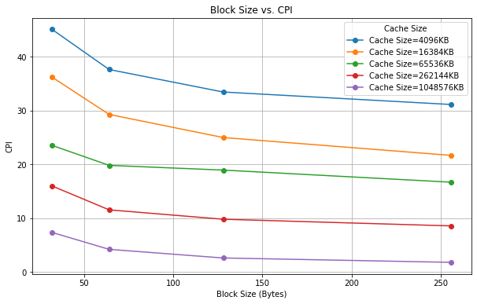
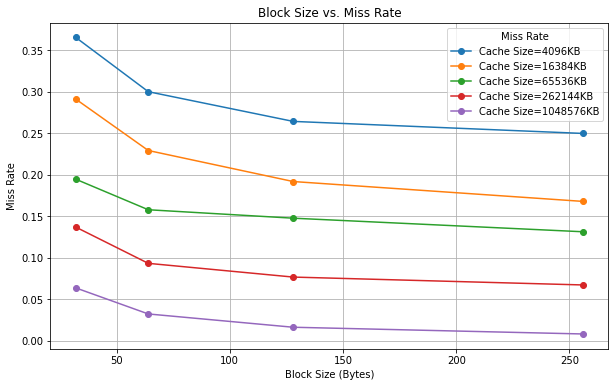
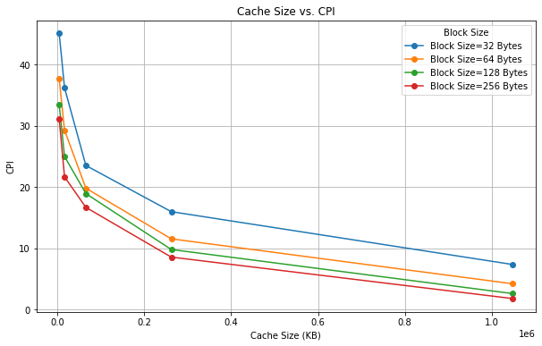
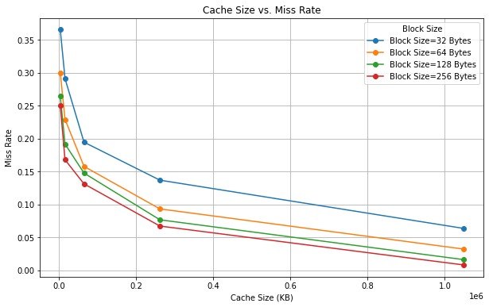
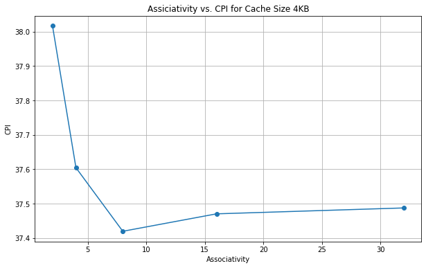
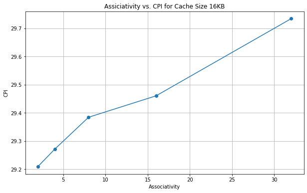
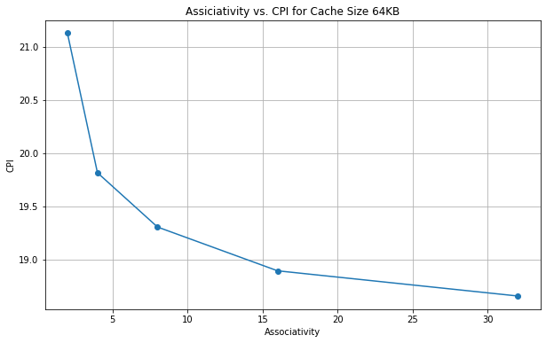

## Usage

Before testing, please put the folders `./cache-trance` and `./riscv-elf` inside the working directory, at the same level as `./src` and `./include`.

### Run Single-Level Cache Simulation
```bash
cd /the_working_space
chmod +x build1.sh
./build1.sh
# Now the single-level cache simulator will be run,
# and the .csv file ./src/analysis_p1.csv will be generated
```

### Run Multi-Level Cache Simulation
```base
chmod +x build2.sh
./build2.sh
# Now the multi-level cache simulator will be run,
# and the .csv file ./src/analysis_p2.csv will be generated
```

### Run Integration with CPU Simulator
```base
chmod +x build3.sh
./build3.sh
./build/Simulator riscv-elf/quicksort.riscv  # run without cache
./build/Simulator -c riscv-elf/quicksort.riscv  # run with cache
# the statistics will be printed in the terminal
```


## Single-Level Cache Simulation
In the first part of this project, I implemented a single-level cache. The cache takes parameters including underlying memory, hit latency, cache size, block size, associativity, write back, write allocate, .etc.

### Write Back and Write Allocate

There are four cases for write back and write allocate policies:

1. **Write-Back = True, Write-Allocate = True**: When a write miss occurs, the cache block containing the target address is loaded into the cache, and then the write operation is performed on the cached block. The modified block is marked as dirty but is not immediately written back to main memory. The dirty data is only written back to the main memory when the cache block is evicted.
2. **Write-Back = True, Write-Allocate = False**: When a write operation occurs, the data is written directly to main memory. However, if the data is already in the cache, it is updated in the cache and marked as dirty. It will only be written back to the main memory upon eviction.
3. **Write-Back = False, Write-Allocate = True**: When a write miss occurs, the cache block is loaded into the cache, and the write operation is executed on the cache. However, all writes to the cache will also be written to main memory.
4. **Write-Back = False, Write-Allocate = False**: When a write operation occurs, the data is written directly to main memory. No write back is used.

### Performance Analysis

The following image shows how different block sizes affect cache performance. We can observe that when holding all other conditions constant, the larger the block size, the better the cache performance. This could be explained by the fact that larger block sizes can bring a larger block of data during a cache miss, which increases the possibility of the next hit.


*Figure 1: Block Size vs. CPI*


*Figure 2: Block Size vs. Miss Rate*

**Figure 3: Effects of block size on performance**

The following image shows how different cache sizes affect cache performance. We can observe that when holding all other conditions constant, increasing the cache size significantly improves performance. However, under the same cache size, the performance of different block sizes does not vary that much. A larger cache size means more faster memory, which will definitely increase performance.


*Figure 4: Cache Size vs. CPI*


*Figure 5: Cache Size vs. Miss Rate*

**Figure 6: Effects of cache size on performance**

The following image demonstrates the influence of associativity on cache performance. When the cache size is 4KB, increasing the associativity can cause better performance at first but worse performance later. However, when the cache size is 16KB, the relationship is positive, while when the cache size is 64KB, the relationship is negative. This shows that increasing associativity does not necessarily mean increasing or decreasing performance.


*Figure 7: Cache Size 4KB*


*Figure 8: Cache Size 16KB*


*Figure 9: Cache Size 64KB*

**Figure 10: Effects of associativity on performance**

